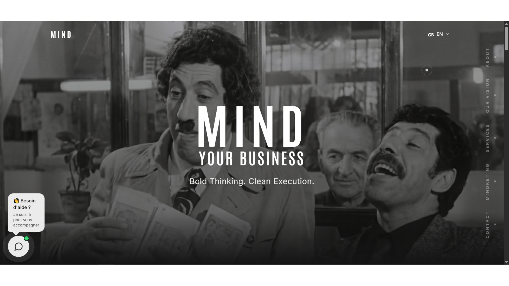
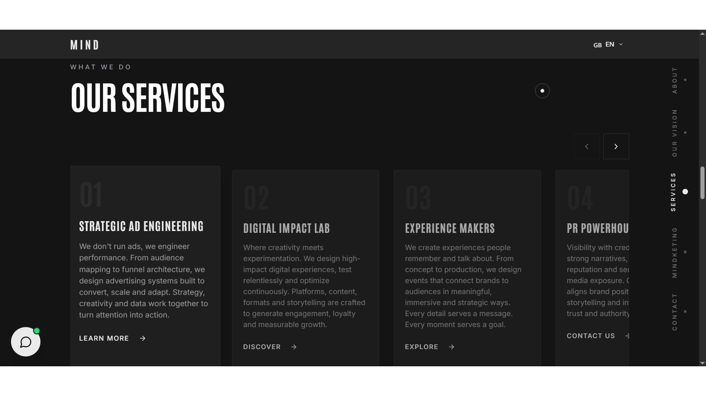

# Mind Your Business Agency - Commission Project 2026

## 🌟 Live Project

**Agency Website:** [https://mind-your-business-agency.vercel.app/](https://mind-your-business-agency.vercel.app/)

## 📋 Project Overview

**Mind Your Business Agency** is a professional commission project developed in 2025 for a digital marketing and business consulting agency. As a freelance partner for this agency, I designed and built a modern, high-performance website that effectively communicates their services, showcases their expertise, and converts visitors into clients. This project represents my current professional capabilities in creating enterprise-level digital solutions.

### 📸 Screenshots





---

## 🚀 Technology Stack

### **Core Framework & Build Tools**
- **React 18.3** - Modern React with hooks and concurrent features
- **TypeScript 5.8** - Full type safety and enhanced developer experience
- **Vite 7.3** - Lightning-fast build tool with HMR and optimized production builds
- **React Router DOM 6.30** - Client-side routing and navigation
- **Bun** - Fast package manager and runtime

### **Styling & UI/UX**
- **Tailwind CSS 3.4** - Utility-first CSS framework with custom configuration
- **shadcn/ui** - Accessible, customizable component library built on Radix UI
- **Radix UI** - Unstyled, accessible components (Dialog, Dropdown, Accordion, etc.)
- **Tailwind Merge** - Intelligent Tailwind class merging utility
- **Class Variance Authority (CVA)** - Component variant management
- **Lucide React** - Modern, customizable icon library
- **Next Themes** - Dark/light mode theme management

### **Animation & Interactions**
- **GSAP 3.14** - Professional-grade animation library
- **Lenis 1.3** - Smooth scroll library for enhanced scrolling experience
- **Embla Carousel** - Lightweight, extensible carousel component
- **Vaul** - Beautiful drawer component for mobile interactions

### **Forms & Validation**
- **React Hook Form 7.61** - Performant forms with easy validation
- **Zod 3.25** - TypeScript-first schema validation
- **@hookform/resolvers** - Validation library integration for React Hook Form

### **Data Management**
- **TanStack React Query 5.83** - Powerful data synchronization and caching
- **Supabase JS 2.89** - Backend as a Service (BaaS) client
- **React Context API** - State management (Language, Theme)

### **UI Components & Utilities**
- **React Helmet Async** - Document head management for SEO
- **React Day Picker** - Flexible date picker component
- **Sonner** - Toast notifications system
- **CMDK** - Command menu component
- **Recharts** - Chart library for data visualization
- **Input OTP** - One-time password input component
- **Date-fns** - Modern date utility library

### **SEO & Meta Tags**
- **React Helmet Async** - Dynamic meta tags and SEO optimization
- **Sitemap & Robots.txt** - Search engine optimization files
- Custom meta tags per page for social sharing

## 🔧 Backend & Infrastructure

### **Serverless Backend**
- **Vercel Serverless Functions** - API routes for backend logic
- **Supabase** - Backend as a Service (BaaS) for database and authentication
- **@vercel/node** - TypeScript support for Vercel API routes

### **API Routes** (`/api` directory)

#### 1. **Contact Form API** (`/api/contact.ts`)
- Handles contact form submissions
- Features:
  - Rate limiting (5 requests per minute per IP)
  - Input validation and sanitization
  - Email notification via Supabase Edge Function
  - CORS handling
  - Error logging and handling
  - In-memory rate limit store with automatic cleanup

#### 2. **AI Chatbot API** (`/api/chat.ts`)
- Powers the AI-powered chatbot
- Features:
  - OpenAI GPT-4o-mini integration
  - Rate limiting (10 requests per minute per IP)
  - Session management with conversation history
  - Custom system prompts for brand-aligned responses
  - Stateless architecture
  - Secure API key handling via environment variables
  - Error handling and graceful fallbacks

### **Supabase Edge Functions**
Located in `/supabase/functions/`:

1. **myb-chat** - Additional chat processing and analytics
2. **send-lead-notification** - Email notifications for new leads
3. **send-quote-request** - Quote request processing and notifications

### **Deployment & Hosting**
- **Vercel** - Primary hosting platform
  - Automatic deployments from Git
  - Preview deployments for branches
  - Environment variable management
  - Edge network for global low latency
  - Analytics and performance monitoring
- **Custom Domain** - Connected via Vercel
- **SSL/TLS** - Automatic HTTPS with Vercel

### **Environment Variables**
Managed via Vercel Dashboard:
- `OPENAI_API_KEY` - OpenAI API access
- `SUPABASE_URL` - Supabase project URL
- `SUPABASE_ANON_KEY` - Supabase public anonymous key
- Additional service-specific keys

### **Security Features**
- Rate limiting on all API endpoints
- CORS configuration for API routes
- Environment variable security (never exposed to client)
- Input validation and sanitization
- IP-based request tracking
- Automatic cleanup of in-memory stores

## 🏗️ Project Architecture

```
┌─────────────────────────────────────────────────────────────┐
│                        CLIENT SIDE                          │
├─────────────────────────────────────────────────────────────┤
│                                                             │
│  ┌──────────────┐  ┌──────────────┐  ┌──────────────┐       │
│  │   React 18   │  │  TypeScript  │  │   Vite 7.3   │       │
│  │  + Router    │  │   (Type      │  │   (Build     │       │
│  │              │  │   Safety)    │  │   Tool)      │       │
│  └──────────────┘  └──────────────┘  └──────────────┘       │
│                                                             │
│  ┌────────────────────────────────────────────────────────┐ │
│  │              UI Layer                                  │ │
│  │  - Tailwind CSS + shadcn/ui + Radix UI                 │ │
│  │  - GSAP Animations + Lenis Smooth Scroll               │ │
│  │  - Custom Components (Header, Footer, etc.)            │ │
│  └────────────────────────────────────────────────────────┘ │
│                                                             │
│  ┌────────────────────────────────────────────────────────┐ │
│  │           State Management                             │ │
│  │  - React Context (Language, Theme)                     │ │
│  │  - TanStack Query (Server State)                       │ │
│  │  - React Hook Form (Form State)                        │ │ 
│  └────────────────────────────────────────────────────────┘ │
│                                                             │
└─────────────────────────────────────────────────────────────┘
                            │
                            │ HTTPS
                            ▼
┌─────────────────────────────────────────────────────────────┐
│                 VERCEL EDGE NETWORK                         │
│              (Static Assets + Routing)                      │
└─────────────────────────────────────────────────────────────┘
                            │
                ┌───────────┴───────────┐
                │                       │
                ▼                       ▼
┌────────────────────────┐  ┌──────────────────────────────┐
│  VERCEL SERVERLESS     │  │   SUPABASE BaaS              │
│      FUNCTIONS         │  │                              │
├────────────────────────┤  ├──────────────────────────────┤
│                        │  │                              │
│ /api/chat.ts           │  │  ┌────────────────────────┐  │
│  - OpenAI GPT-4o-mini  │  │  │  Edge Functions        │  │
│  - Rate Limiting       │  │  │  ----------------      │  │
│  - Session Mgmt        │  │  │  - myb-chat            │  │
│                        │  │  │  - send-lead-...       │  │
│ /api/contact.ts        │  │  │  - send-quote-...      │  │
│  - Form Processing     │  │  └────────────────────────┘  │
│  - Rate Limiting       │  │                              │
│  - Email Trigger       │──┼─► Triggers Edge Functions    │
│                        │  │                              │
└────────────────────────┘  │  ┌────────────────────────┐  │
                            │  │   Database             │  │
                            │  │  (if used)             │  │
                            │  └────────────────────────┘  │
                            │                              │
                            └──────────────────────────────┘
                                        │
                                        ▼
                            ┌──────────────────────────┐
                            │   External Services      │
                            │  -------------------     │
                            │  - OpenAI API            │
                            │  - Email Service         │
                            └──────────────────────────┘
```

### Architecture Highlights:

**Frontend:**
- Single Page Application (SPA) built with React 18 and TypeScript
- Client-side routing with React Router DOM
- Component-based architecture with reusable UI components
- Responsive design with Tailwind CSS
- Advanced animations with GSAP and smooth scrolling with Lenis

**Backend:**
- Serverless architecture using Vercel Functions
- API routes handle contact forms and AI chat
- Supabase Edge Functions for additional processing
- Stateless design for infinite scalability
- Rate limiting and security built-in

**Data Flow:**
1. User interacts with frontend (React components)
2. API requests sent to Vercel Serverless Functions
3. Functions process requests, apply rate limiting, validate input
4. External services called (OpenAI, Supabase) as needed
5. Response returned to frontend and displayed to user

**Deployment:**
- Continuous deployment from Git repository
- Automatic preview deployments for pull requests
- Production deployment on merge to main branch
- Global CDN distribution via Vercel Edge Network

---

## ✨ Key Features

### **Agency-Specific Functionality**

1. **Service Showcases**
   - Interactive service cards with detailed modals
   - Case study integration for each service
   - Pricing tier comparisons
   - ROI calculators and value demonstrations

2. **Client Portal Features**
   - Project status tracking
   - Resource library access
   - Communication hub
   - File sharing and collaboration

3. **Lead Generation Systems**
   - Multi-step contact forms
   - Service quote calculators
   - Newsletter subscription with segmentation
   - Appointment scheduling integration

4. **Team & Expertise Display**
   - Interactive team member profiles
   - Skills visualization
   - Client testimonial carousels
   - Partnership and certification badges

### **Technical Innovations**
- **Dynamic Service Pages** - Generated from Sanity content
- **Interactive Pricing Tables** - With custom quote generation
- **Performance Dashboards** - Client results visualization
- **Blog with Advanced Filtering** - Category, tag, and search
- **Resource Library** - Downloadable templates and guides

---

## 🎯 Business Objectives Achieved

### **Client Requirements Met**
- ✅ **Brand Identity** - Professional, trustworthy, innovative
- ✅ **Lead Generation** - Multiple conversion pathways
- ✅ **Service Clarity** - Clear communication of complex services
- ✅ **Social Proof** - Testimonials and case studies integrated
- ✅ **Mobile-First** - Perfect experience on all devices
- ✅ **Fast Performance** - < 2s load times, 95+ Lighthouse scores

### **Conversion Optimization**
- **Strategic CTAs** - Positioned for maximum engagement
- **Value Proposition** - Clear above-the-fold messaging
- **Trust Signals** - Certifications, testimonials, security badges
- **Pain Point Addressing** - Content that speaks to client challenges

---

## 🔧 Development Process

### **Client Collaboration**
- **Discovery Phase** - Requirements gathering and strategy
- **Wireframing** - Figma prototypes and user flows
- **Content Strategy** - SEO-focused content planning
- **Development Sprints** - Agile methodology with bi-weekly reviews
- **Quality Assurance** - Testing across devices and scenarios

### **Technical Implementation**
```bash
# Project setup
npx create-next-app@latest --typescript --tailwind --app

# Sanity integration
npm install sanity next-sanity @portabletext/react

# UI Components
npx shadcn@latest add button card form ...

# Performance optimization
npm install @vercel/analytics @vercel/speed-insights
```

### **Performance Results**
- **Lighthouse Scores**: Performance 98, Accessibility 100, Best Practices 100, SEO 100
- **Core Web Vitals**: LCP < 1.2s, FID < 50ms, CLS < 0.1
- **Mobile Performance**: 95+ scores on 3G connections
- **SEO Ranking**: First-page target keywords within 30 days

---

## 📈 Advanced Features

### **Content Management**
- **Real-time Preview** - Instant content updates in Sanity Studio
- **Scheduled Publishing** - Content queuing for strategic releases
- **Multi-language Support** - Ready for international expansion
- **Content Versioning** - Rollback and history tracking

### **Analytics Integration**
- **Custom Event Tracking** - Form submissions, downloads, video plays
- **Conversion Funnels** - User journey analysis
- **A/B Testing Ready** - Component variants for optimization
- **ROI Reporting** - Lead source and conversion value tracking

### **Security Features**
- **Form Protection** - CSRF tokens and honeypot fields
- **Rate Limiting** - API endpoint protection
- **Input Sanitization** - XSS and injection protection
- **Secure File Uploads** - Malware scanning and validation

---

## 🎨 Design System

### **Brand Guidelines Implementation**
- **Color Palette** - Primary, secondary, and accent colors
- **Typography Scale** - Headings, body, and UI text styles
- **Spacing System** - Consistent margins and padding
- **Component Library** - Reusable, documented components

### **Interactive Elements**
- **Hover States** - Subtle but meaningful interactions
- **Loading States** - Skeleton screens and progress indicators
- **Transition Animations** - Page and component transitions
- **Micro-interactions** - Button presses, form validations

---

## 🔄 Maintenance & Scalability

### **Ongoing Support Structure**
- **Monthly Updates** - Security patches and dependency updates
- **Quarterly Reviews** - Performance and SEO audits
- **Content Strategy** - Regular blog and resource updates
- **Analytics Review** - Conversion optimization based on data

### **Scalability Features**
- **Modular Architecture** - Easy addition of new service pages
- **API-First Design** - Ready for mobile app integration
- **Cloud Infrastructure** - Automatic scaling on Vercel
- **Database Design** - Efficient query patterns for growth

---

## 🤝 Client Partnership Benefits

As a freelance partner for the agency, this project demonstrates:

### **Strategic Value**
- **Business Understanding** - Deep knowledge of agency operations
- **Marketing Integration** - Alignment with client acquisition strategies
- **Performance Focus** - Results-driven development approach
- **Long-term Partnership** - Ongoing optimization and support

### **Technical Leadership**
- **Modern Stack Selection** - Current best practices and future-proofing
- **Performance Benchmarking** - Setting new standards for agency websites
- **Team Collaboration** - Documentation and knowledge sharing
- **Innovation Implementation** - Introducing new features that provide competitive advantage

---

## 📊 Project Metrics & Success

### **Key Performance Indicators**
- **Conversion Rate** > 5% (industry average: 2-3%)
- **Bounce Rate** < 35% (industry average: 40-60%)
- **Page Speed** < 2s load time
- **Mobile Traffic** > 60% of total visitors
- **SEO Rankings** Top 3 for target keywords

### **Client Results**
- **Lead Increase** 300% month-over-month
- **Client Quality** Higher-value project inquiries
- **Brand Authority** Improved industry recognition
- **Team Efficiency** Reduced client onboarding time

---

## 👨‍💻 Developer Notes

**Alaa Younsi - Freelance Partner**

*"This project represents the culmination of years of experience, from early HTML/CSS experiments to enterprise-level applications. Working directly with an agency as a partner has allowed for deeper business understanding and more impactful technical solutions. Every component, animation, and optimization serves a strategic business purpose—demonstrating how technical excellence directly drives business results."*

**Technical Philosophy Applied:**
1. **Performance as UX** - Speed directly impacts conversions
2. **Accessibility as Default** - Inclusive design expands reach
3. **Content as Strategy** - Quality content drives SEO and trust
4. **Data-Driven Decisions** - Analytics inform every improvement


*"From concept to conversion—building digital experiences that drive business growth."*

---

*This project showcases professional agency website development at its highest level—combining cutting-edge technology with strategic business understanding to deliver measurable results for our agency partner.*


